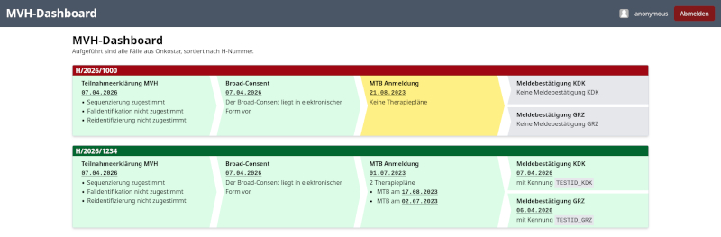

# MV-Dashboard

Anwendung zum Anzeigen der Fälle für das MV Genomsequenzierung gem. § 64e SGB V und deren Status.

## Konfiguration

Beim Start der Anwendung können Parameter angegeben werden.

```
Usage: mv-dashboard [OPTIONS]

Options:
      --listen <LISTEN>                The address to listen on [env: LISTEN=] [default: 0.0.0.0:3000]
      --onkostar-url <ONKOSTAR_URL>    The X-API URL [env: ONKOSTAR_URL=] [default: http://localhost:8080/onkostar]
      --cookie-domain <COOKIE_DOMAIN>  The cookie domain to be used (optional) [env: COOKIE_DOMAIN=]
      --cache-enabled                  Enable caching of dashboard data [env: CACHE_ENABLED=]
  -h, --help                           Print help
  -V, --version                        Print version
```

Die Anwendung lässt sich auch mit Umgebungsvariablen konfigurieren.

* `LISTEN`: Die zu verwendende Adresse und Port.
* `ONKOSTAR_URL`: URI für Onkostar API Requests (z.B. http://localhost:8080/onkostar)
* `COOKIE_DOMAIN`: Der zu verwendende Cookie-Domain (optional)
* `CACHE_ENABLED`: Aktiviert Cache mit 5 Minuten Lebensdauer


## Lizenz

AGPL-3.0